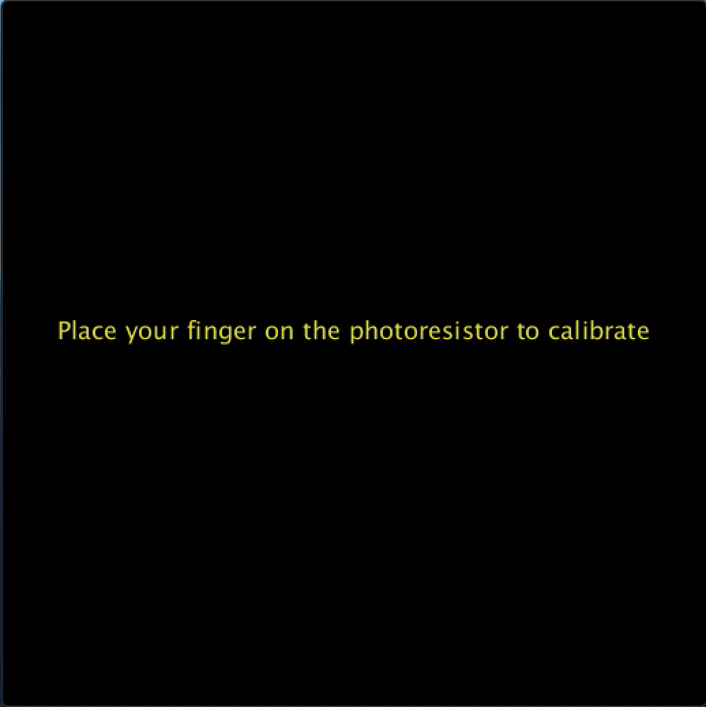
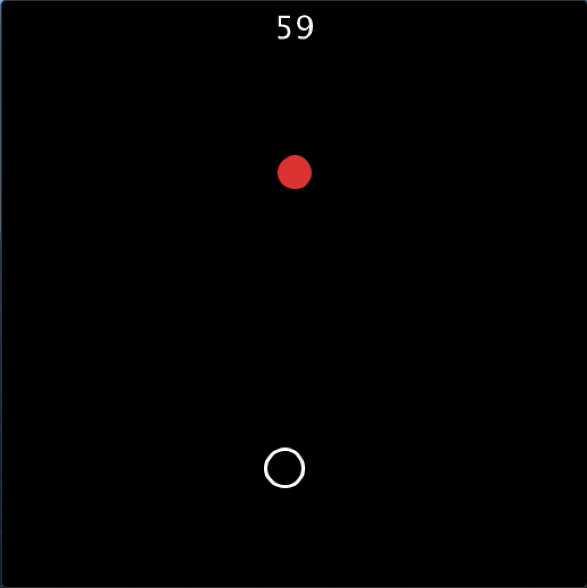
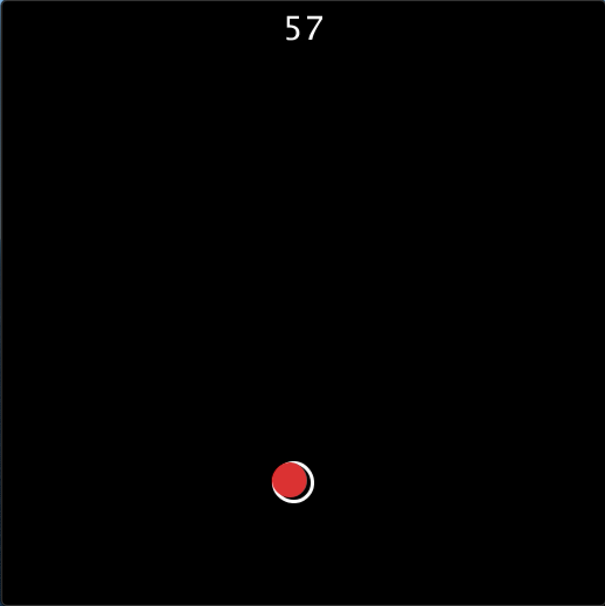
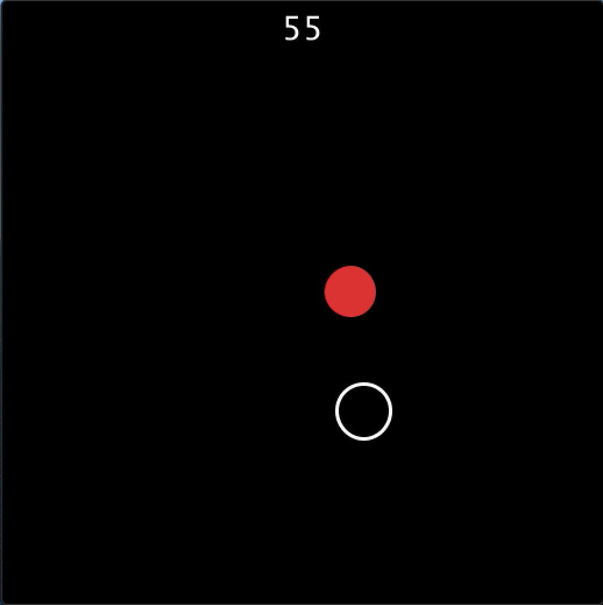
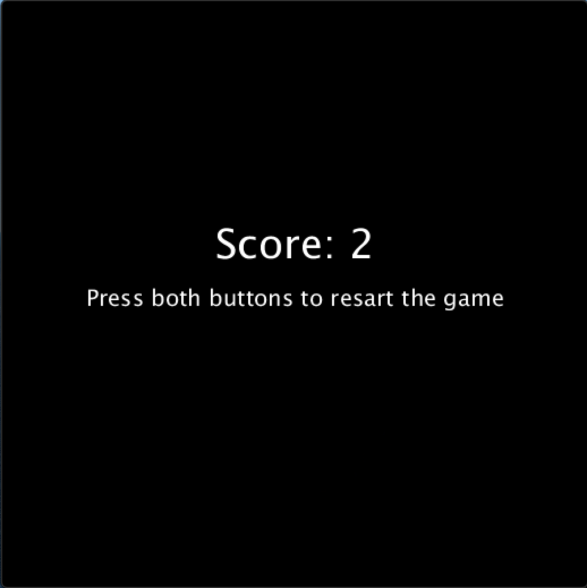

# Assignment 8: Simple Arduino-Processing Game

  
  

## Description

## Instructions
1. Calibrate the photoresistor when the game starts (credits to Chinonyerem) by placing your fingers on and off the photoresistor. The user has up to 5 seconds to do so. If calibration failed, a defualt mapping range is set.

  

2. Use the photoresistor to control the vertical position. The more light the photoresistor senses, the higher up in the screen the position of the circle.

  
  
  

4. Use the yellow and green buttons to control the horizontal position. Green moves the circle right and yellow moves the circle left.

  

5. Using the photoresistor and switches, move the red circle into the white circle. New red and white circles will be generated in a new position. Try to move as many red circles into white circles as possible in 1 minute.

  

7. At the end of the game, the score is displayed. Press both switches to restart the game.

  

## Demo

  

Click [here]() for a video demo.

## Process
1. 

## Schematic

  

## Challenges

## Discoveries
