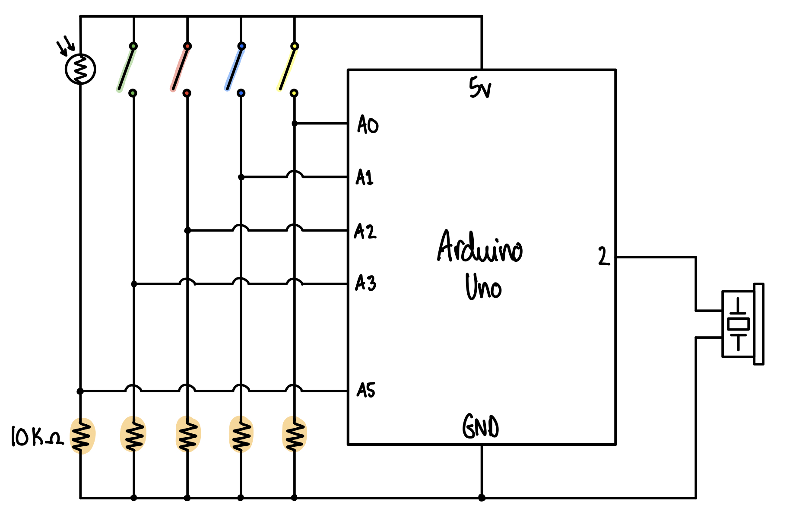

# Assignment 7: Musical Instrument (The Sci-Fi Soundtrack Maker)

<p align="center">
  
</p>

## Description
The production assignment for this week was to make a musical instrument using at least one analog input and at least one digital input. My initial plan was to make some sort of Arduino version of a violin using 4 switches to represent the strings and a potentiometer to mimic when the note changes based on where you press your fingers on the strings. However, I didn't like the feel of the potentiometer as it was quite hard to turn and felt very unstable on the breadboard, therefore, I switched it out for a photoresistor. Doing this produced sounds that reminded me of a Sci-Fi move so I decided to play into that idea. I ended up making an instrument that is a 'Sci-Fi movie soundtrack maker' using a photoresistor, a buzzer, and four switches. Each switch corresponds to one default note which gets distorted by the value given by the photoresistor. I ended up keeping the default notes corresponding to each switch the same as the notes on the violin (greenSwitch = G [196 Hz], redSwitch = D [294 Hz], blueSwitch = A [440 Hz], yellowSwitch = E [659 Hz]) because it sounded like it already worked pretty well so might as not change it. It also didn't matter too much what notes I chose as the photoresistor would distort it anyway, hence, the inspiration for the name of my instrument.

## Demo
<p align="center">
  
</p>

Click [here](https://youtu.be/e19SDqF_XA4) for a video demo.

## Process
1. Placed the switches, photoresistor, and buzzer on to the breadboard, taking into account how I want to wire and interact with them.
2. Connected each component to an input and output pin accordingly.
3. Declared the variables to know which pin corresponds to each component.
4. Set all the switches and the photoresistor as outputs (no need to set the buzzer as an output).
5. Defined the default note frequencies corresponding to each switch.
6. Read the photoresistor value using analogRead() and mapped it between 400 and 0 to increase the pitch with less light. This becomes the ```toneChange``` variable which changes the original note according to the sensor value of the photoresistor.
7. Wrote ```if()``` statements to condition which note to play when each switch is pressed

## Schematic
<p align="center">
  
</p>

## Challenges
The main challenge I had was  finding a good range to map the input value from the photoresistor. The pitch tends to not change much unless I am very close to the photoresistor. Then the change is very rapid and difficult to control. I tried mapping it to a larger range so I hear the change easier but the result is still highly variable depending on which time of the day you use the device.

## Discoveries
1. You don't need a seperate pitches.h file defining the notes with the frequencies (ex. ```#define NOTE_E5  659```). You can just declare the notes as integers as they are frequency readings (ex. ```int NOTE_E5 = 659```).
2. Arduino does not give index out of bounds error warnings so I ended up pulling my whole circuit apart thinking something was wrong with the breadboarding. Turns out I just forgot that Arduino starts at 0 and was indexing my array one number too high.

