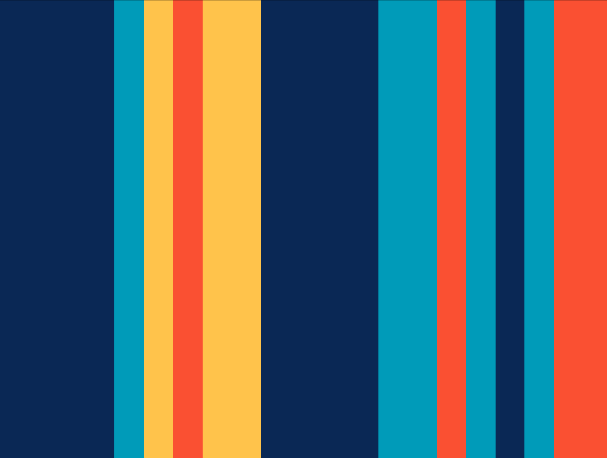
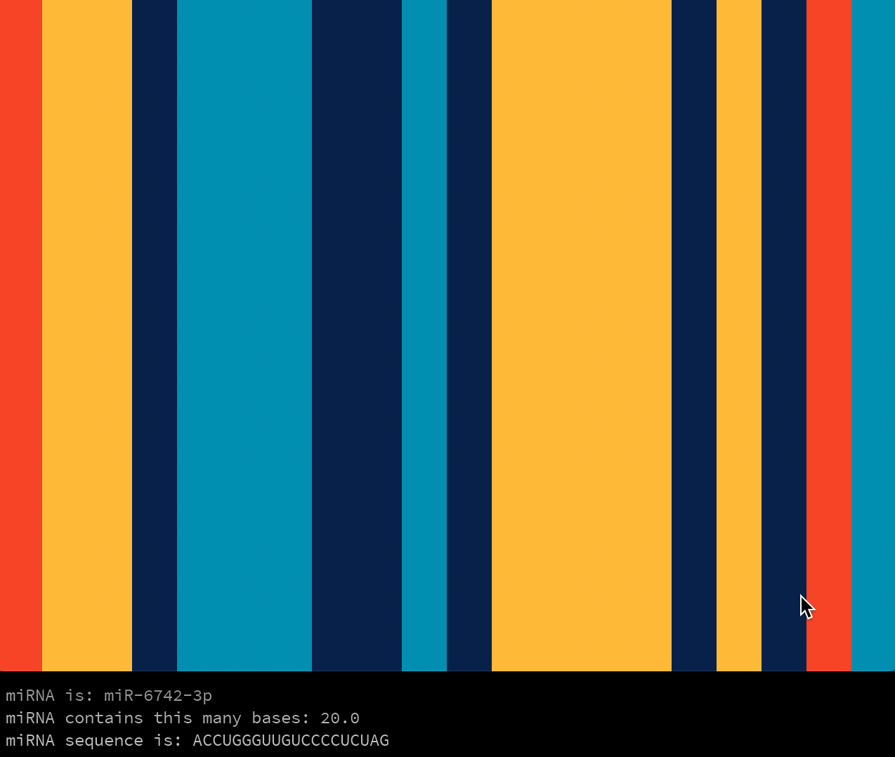

# Assignment 4: Data Visualization

  
  

  Left: miR-30a-5p, Right: miR-507.

## Description
For this assignment, I decided to create a simple data visualization of mature human miRNA sequences. These are short sequences of RNA that negatively regulate gene expression. As a biology major currently investigating the role of miRNAs in host susceptibility to malaria for my capstone, I thought it would be interesting to create a visualization for these sequences in a fun and creative way. I wanted my visualization to almost feel like art, while remaining informative for those who understand the biology of it. Therefore, I kept the visuals very simple. Each base (there are a total of 4: A, C, G, and U) is assigned a color (orange, yellow, light blue, and dark blue, respectively), and is displayed in rectangles of equal widths in sequential order. One miRNA is displayed at a time and a mouseclick randomizes the next miRNA to be displayed (out of a total of 2656 miRNAs). The name, sequence length, and sequence of the miRNA is also printed in the processing console (example in the demo below). I chose not to print the names on the actual visual demonstration because it takes away from the more 'artsy' feel that I wanted to create. I believe the data visualization still remains factual and representitive of the miRNA sequence even without the miRNA information (which can be accessed in the console if need be). I thought it was very cool to be able to visualize the nucleotide composition of each miRNA. I found that when looking at the sequence itself (ex. miR-30a-5p, UGUAAACAUCCUCGACUGGAAG ), the alphabets become somewhat blurred into each other and is hard to read. But visualizing it using bars and 4 colors (ex. left image above), makes it easier for me to understand the composition and order of the nucleotides.

## Demo

  

## Process
1. I obtained the mature miRNA sequences from [miRBase](http://www.mirbase.org/ftp.shtml) (a miRNA database). The raw data is a fasta (.fa) file which is a file that contains reference sequences. This file contains over 40000 miRNA sequences, and only around 2500 of those are human sequences.
2. I converted the fasta file to csv and filtered out non-human miRNAs using a script which I also uploaded to github (fasta2csv_filtering.csv).
3. The csv file was loaded into processing in an array and the selected 'row' is randomized.
4. The string was split to separate the miRNA name and sequence.
5. The index containing the sequence was used to calculate the sequence length (which varies but averages around 20 nucleotides) and divide the width of the screen into equal parts.
6. I then parsed through the sequence to check the base of each nucleotide and draw a rectangle colored based on the letter (A, C, G or U) in that position.
7. The noLoop() funtion was used to prevent the draw() function from continuously executing. A loop() function was included in the mouseClicked() function to randomly select a new miRNA to draw.

## Challenges
Since my original data was a fasta file, I had to spend quite a good amount of time finding a way to convert it to csv and filter out any information I don't need. I found a script online ([link here](https://www.researchgate.net/post/Converting_a_fasta_file_to_a_tab-delimited_file10/502907d5e4f076464a000011/citation/download.)) that does the conversion. However, I still had to do some data manipulation to split all the information containined in the original fasta file into different columns and filter out non-human miRNAs based on species information.

## Discoveries
I am across the switch() statement ([example here](https://www.w3schools.com/java/java_switch.asp)) which takes an expression that evaluates it against different cases and executes a block of code if there is a match. I thought it was a pretty neat alternative to if() statements, allowing me to loop through the sequence, match the base to each of the four cases, and draw the rectangle based on the match.

## Moving Forward
To make the data visualization more usable, I could include a way for the user to select with miRNA they want to visualize. This would require me to either allow the user the select from a set list of type in their miRNA of interest. The latter seems like the more appropriate option considering there are a total of over 2500 mature human miRNA sequences. However, it would also mean that I would have to include ways to account for all the differences between my set list of miRNAs and what the user types (ex. case, spaces etc).
