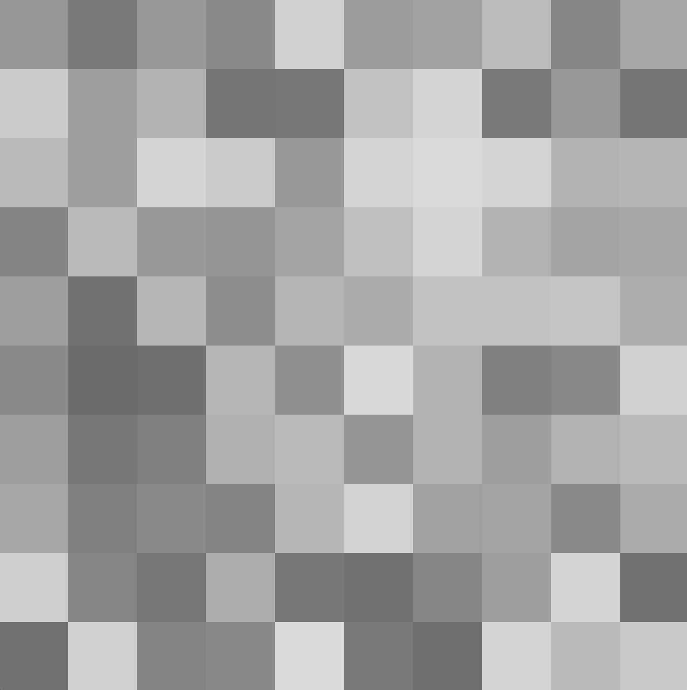
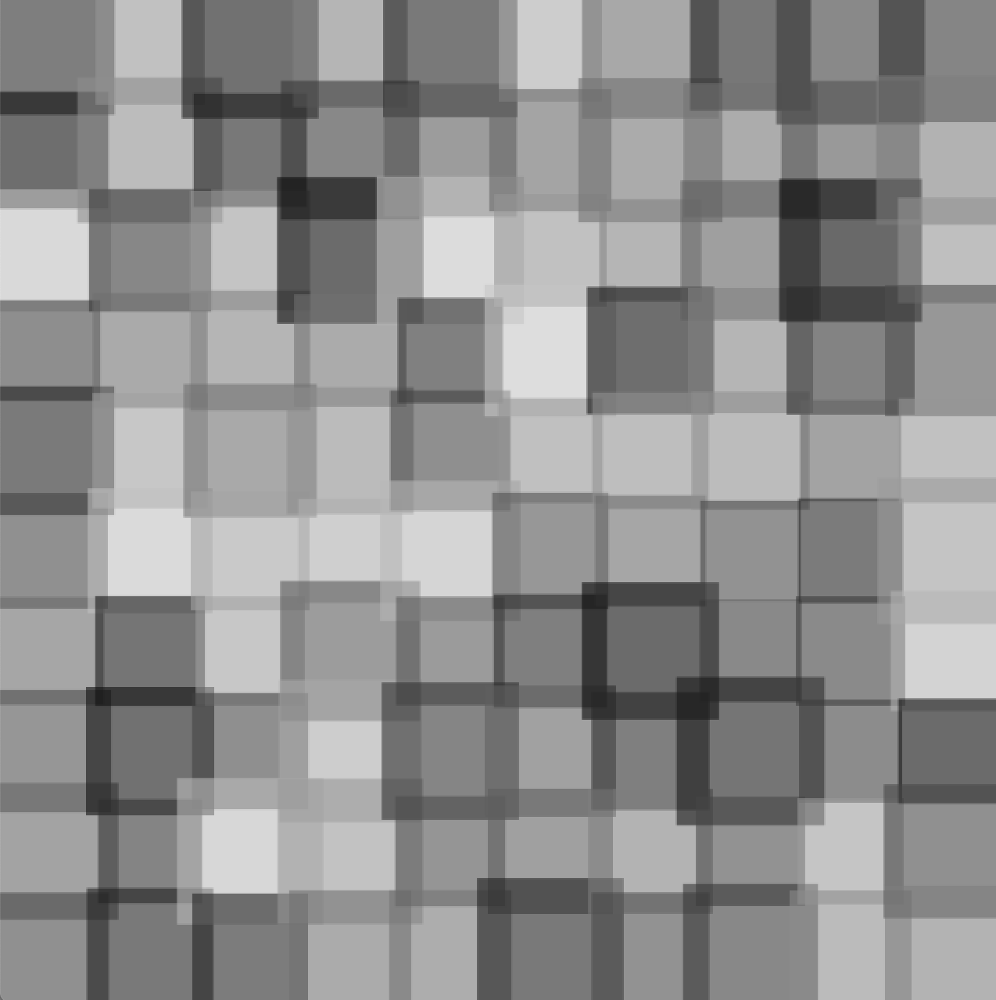
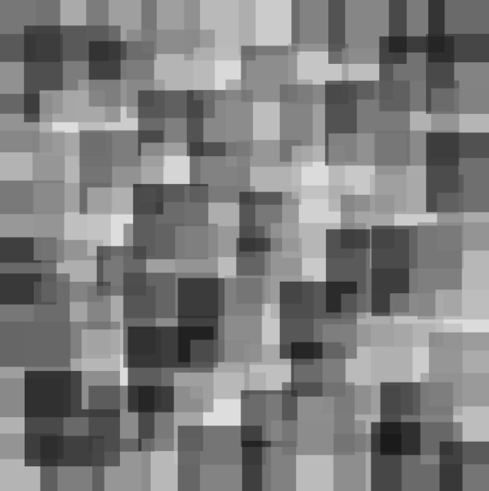

# Assignment 2: Computer Graphics and Art

  
  
  

From left to right: mouseX on the left most, mouseX in the middle, mouseX on the right most.

## Description
For this assignment, I decided to create an interactive grid of squares with various shades of grey that varies in size based on the X position of the mouse. The greater the X position, the more range the size may vary over, increasing the "noise" in the image. My initial idea involved drawing overlapping rectangles of different sizes at random locations. However, I wanted to make better use of the whole canvas so I thought about how I could organize the rectangles in a way such that they would be relatively evenly-spaced. I then wanted to introduce some disorder so I added a random() component to the rectangle width and height. In order to make the piece interactive, I decided to make it so that the user can control the degree of randomness.

## Process
1. Created the grid using nested for() loops to set the X and Y position of each rectangle
2. Randomized the grey color in each square and decreased the opacity so any overlapping can be seen
3. Added a random() range in the rectangle width and height to create some disorder in the grid
4. Made the degree of disorder controllable by mapping the mouseX position

## Difficulties

## Discoveries
