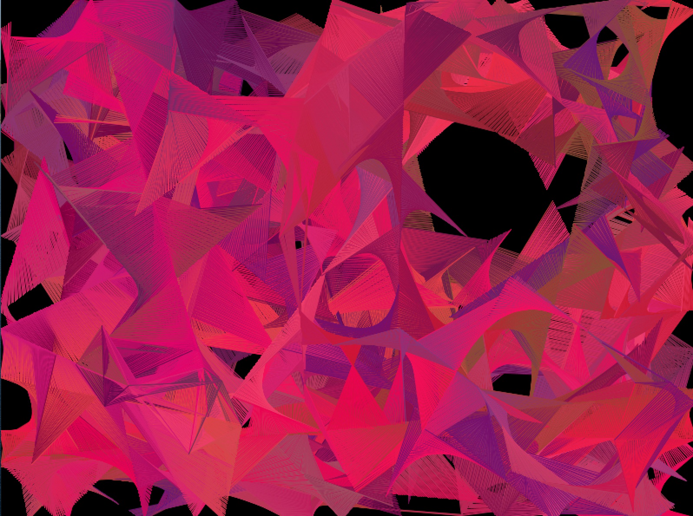
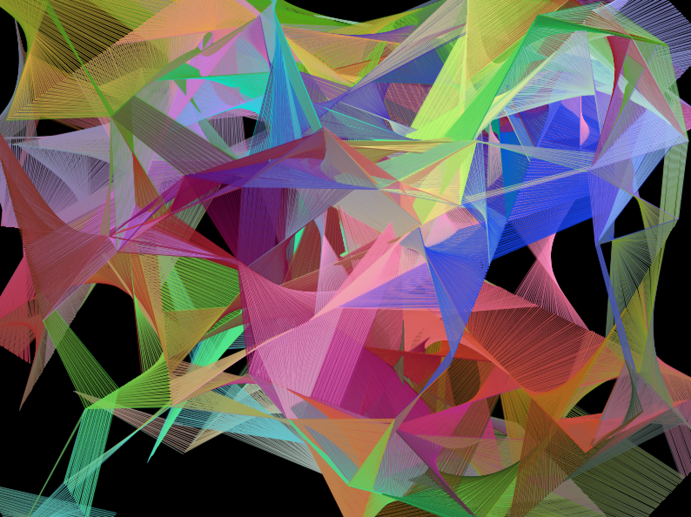

# Assignment 3: Artwork/Game using Object Oriented Programming

  
  

## Description
For this assignment, we were asked to create an artwork or game using object-oriented programming. I chose to create art because it's just something that appeals to me more. I drew inspiration from an old project of mine on particle systems on p5.js [(link here)](https://editor.p5js.org/ariyachlt/sketches/u24N-xgrC). In the p5.js version, the particles of various sizes starting at random positions move around the screen, reflecting off each other and the edges, and when in close enough proximity, a line is drawn connecting the particles. This new (and improved) particle system actually has no particles at all (at least none that are visible!). I chose to only use the "invisible" positions of the particles to direct my connecting lines to create the artwork. This way, I also didn't have to care much about particles colliding with each other. I also declard my background() in setup() instead of draw() so that it does not get refreshed at every frame. This way the lines overlay ontop of each other. I also added another twist to randomize the color of the lines depending on the color of the first of the two "particles". Each time the demo is played, a new image is drawn because the initial positions of the particles are randomized. I have included an option to click to "refresh" the screen instead of having to close and replay it each time. I played around with a few color schemes and decided I liked the red tones more (left image) because I like to keep things simple. However, I still wanted to include how it looked when I completely randomize the colors (right image).

## Demo

  

## Process
1. Declared the size and background in the setup() function.
2. Wrote the Particle class to describe the properties of each particle (position, color, speed, direction).
3. Write to Particle System class to describe how to particles should interact with each other (line color, when to connect the lines).
4. Constructed an array list of particles objects in setup().
5. Draw the system in draw().

## Challenges
My main challenge came after writing the Particle class. It took me quite some time to figure out the syntax of how to write the Particle System class, more specifically, how to deal with arrays when I am trying to store my particles. After some intesnse googling, I came across [ArrayLists](https://processing.org/reference/ArrayList.html) which allows me to store objects and can resize dynamically. I can't say I fully understand the syntax, but after playing around with the code and refering to the processing reference example, I've somehow managed to make it do what I want it to do (I think).

## Discoveries
The most interesting discovery for me this week is actually connected to my challenge with arrays. I've learned that the syntax for arrays in JavaScript and Java is actually VERY different and that it is way more confusing in Java.
