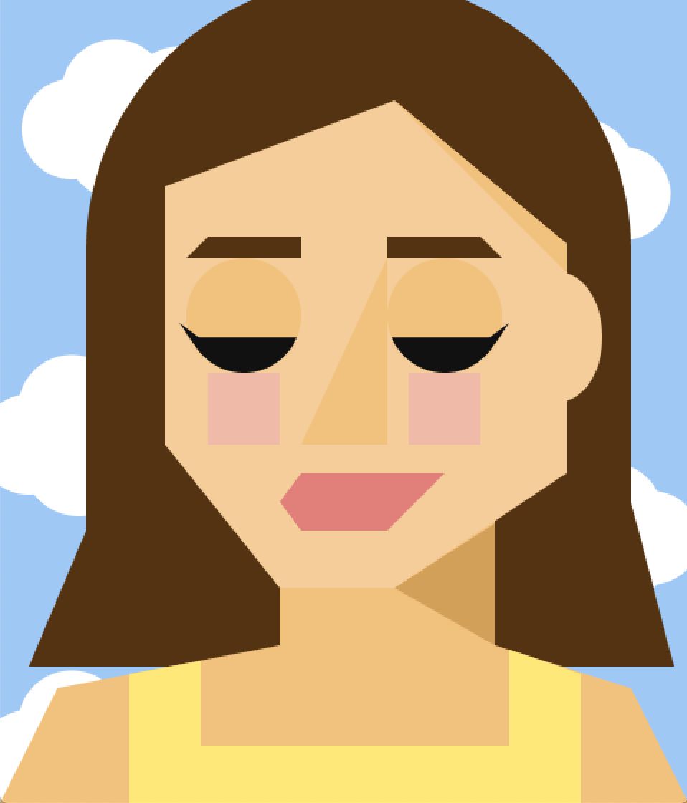

# Self Portrait on Processing

For my self portrait, I decided to attach and overlap basic shapes to create a geometric portrait rather than a realistic one. I played around with a few different styles before settling on this one (hence the name Self_Portrait3). In my first attempt, I actually tried to make it look quite realistic. However, I simply did not like how it looked so I went online to look for some inspiration. I came across a graphic designer student's portrait on a blog [here](https://mollyfromraleigh.wordpress.com/tag/museum/) and decided to adopt the style. I tried to code most of the shapes relative to each other using the
width, height, and variables. However, it became really complicated very quickly so I ended up doing some of the math on paper and punching in the raw numbers. Something interesting I discovered was the syntax of declaring arrays as variables and looping through them in processing as most of my coding experience has been on R.
