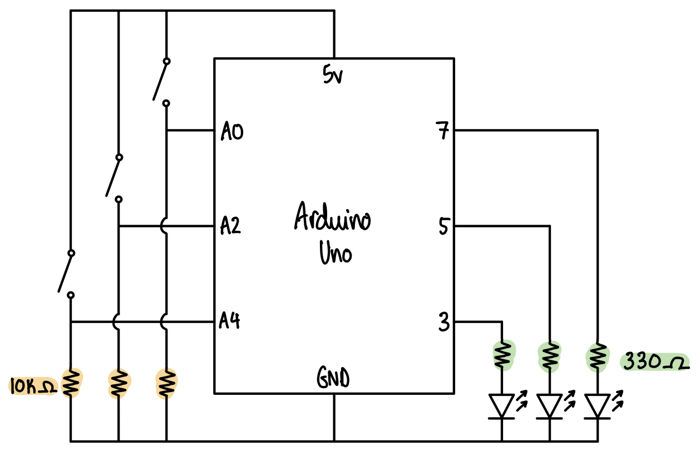

# Assignment 5: Momentary Switch Light Puzzle

<p align="center">
  
</p>

## Description
For this assignment, we were asked to create a puzzle that can be solved by pressing buttons using atleast 3 momentary switches and at least 3 LEDs. I decided to use 3 of each because the breadboard can get easily crowded and I like to keep things clean and organized for my own sanity. The goal of my puzzle is simple: find the right combination of switches to turn all LEDs on. Since there are 3 switches with two states each ('on' or 'off'), I can create a combination of 8 'states' that the switches can be in. I decided on an arbritary winning condition (which I won't spoil right now) and coded my program around hinting towards the correct combination of switches using blinking lights. I don't want to give any hints as to how to interpret the blinking right now but the solution is commented in the code including how each combination leads to each blinking state. I kept all the lights one color (green) and purposely chose switches of random colors that do not correspond to the lights at all (yellow, blue and red). Although colors don't matter too much when it comes to how the program functions, I wanted to create a separation between the switches and the LEDs as each switch does not simply correspond to a particular LED. I also wanted all LEDs to have equal weight, hence the uniform color I chose.

## Demo
<p align="center">
  
</p>

## Process
1. Declared the variables to know which pin corresponds to each switch and LED
2. Set all the LEDs and outputs and switches as inputs
3. Wrote if conditions with the 8 possible 'states'
4. Filled in each condition with how I wanted my lights to blink. The blinking speed and combination of blinking lights depends on how close you are to the solution and hints to which switches need to be turned on or off.

## Schematic
<p align="center">
  
</p>

## Challenges
My main challenge is in keeping the the breadboard and arduino organised rather than the actual programming. It can be quite easy to get confused which pin corresponds to which component and get caught in all the crossing wires therefore I found it quite helpful to write things down as soon as I plug something in. I actually spent the most time taking my breadboard apart and reorganizing it until I was happy with the placement of the switched and LEDs as well as how the wires crossed.

## Discoveries
I found that when working with multiple conditions, it is much easier to keep track of the combinations of switches in an if else statement where I put the value of each switch in the condition rather than write a nested for loop. I'm not sure of this explanation makes sense but I included an example below to show what I am trying to say.

```
\\ easier to keep track of combinations
if (switch1Position == HIGH && switch2Position == LOW && switch3Position == LOW) {
  ...

\\ harder to keep track of combinations (especially when there are many)
if (switch1Position == HIGH) {
  if (switch2Position == LOW) {
    if (switch3Position == LOW) {
    ...

```

