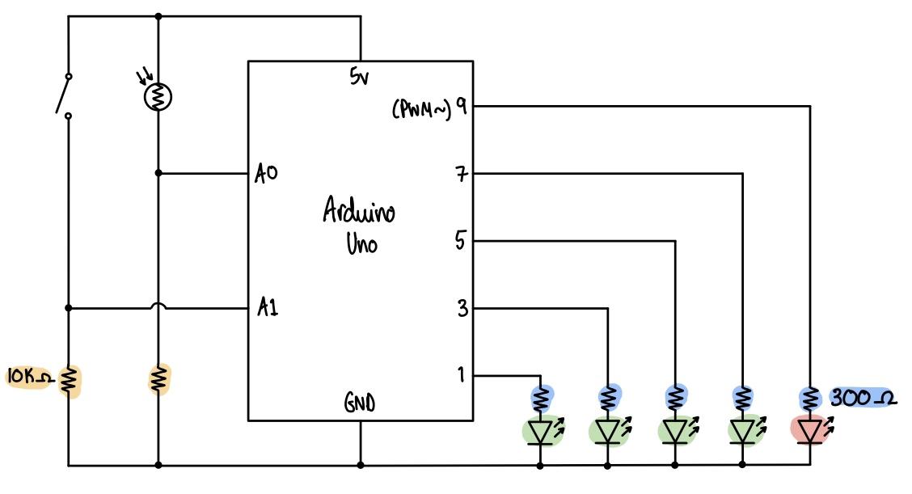

# Assignment 6: Analog vs. Digital

<p align="center">
  
</p>

## Description
For this assignment, we were asked to get information from at least one analog sensor and at least one digital sensor (a switch), and use this information to control at least two LEDs, one in a digital fashion and the other in an analog fashion, in some creative way. For my interactive piece, I drew inspiration from the high-striker game, a strength-tester attraction used at fairs, to create LEDs that flash in sequential order (in a normal state) at the rate of a fading LED at the top (I think it's much easier to understand what is going on from the Demo than to put in words). I decided to use the photoresistor as the analog sensor, the switch as the digital sensor, 4 green LEDs controlled in a digital manner, and 1 red LED controlled in an analog manner. The photoresistor controls the rate at which the green LEDs flash and the fading amount of the red LED so that they also match each other while the switch controls the flashing pattern of the green LEDs. Moving your hand closer to the photoresistor mimics the action of 'striking' the puck in the high striker game harder which makes the LEDs flash the pattern faster. Although the change of pattern doesn't really have much to do with the game I drew my inspiration from, I thought it would be an interesting way to represent when the game is 'out of order' by literally flashing the LEDs out of order.

## Demo
<p align="center">
  
  
</p>

The photoresistor controls the speed of the green lights turn on and off and the LED fade amount (LEFT). The switch changes the pattern the green LED flashes (RIGHT). Click [here](https://youtu.be/mniN0i_mGFo) for a video demo.

## Process
1. Placed the LEDs, switch and photoresistor on to the breadboard, taking into account how I want to interact with them.
2. Connected each component to an input and output pin accordingly, making sure that the red LED is connected to a pin that supports analog outputs (PWM~).
3. Declared the variables to know which pin corresponds to each component.
4. Set all the LEDs and outputs, and the switch and photoresistor as inputs.
5. Declared the initial brightness (used for the red LED) as 0 and default ```fadeAmount``` as 1.
6. Read the photoresistor value using ```analogRead()``` and map it between 20 and 0.5. This is the ```fadeMultiplier``` variable which changes the ```fadeAmount``` according to the sensor value of the photoresistor.
7. Use the ```fadeAmount``` and ```fadeMultiplier``` to control the brightness of the red LED (including the speed it fades).
8. Wrote a ```switch()``` statement to evaluate the brightness value of the red LED and turn of and off green LEDs in a specific order.
9. Read the switch value using ```digitalRead()``` to determine the flashing pattern by incorporating the condition it into the switch() statement.

## Schematic
<p align="center">
  
</p>

## Challenges
I initially overcomplicated things by trying to flash the green LEDs in order using the value from the map function. It took much longer than it should have before I realised I could simply use the brightness value of the red LED in equal steps. I also noticed that the red LED appears to fade in and out faster than I would like (the time it spends looking 'bright' is much longer so the fade is not as clear). I realised that this is because our eyes perceive changes in light levels logarithmically so my linear change in the fade amount was the problem. In the future, I could try to change the face amount logarithmically so it feels more natural.

## Discoveries
I actually tried to draw the schematic before building the circuit as suggested by Prof. Michael but I personally found it much easier to build the circuit first, code around it to make sure it is behaving the way I intended for it to, then draw the schematic. This is because I actually like playing around with the circuit and trying things out and making sure it works before putting anything down on paper. I can also be quite indecisive so this way of working prevents me from wasting time redrawing all my circuit ideas before knowing if it is doing what I want it to do or not. However, I can also see why the order that I like to do things is flawed because the first time around I forgot to put in a resistor for my switch and my lights were flashing out of control. If I had drawn the circuit first, I probably wouldn't have forgotten to put a resistor in.


