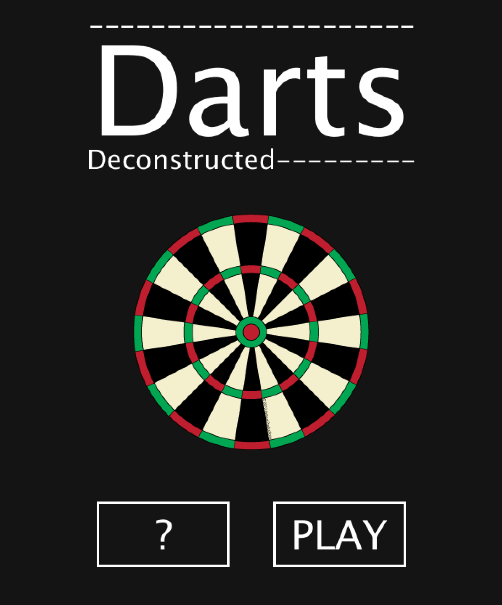
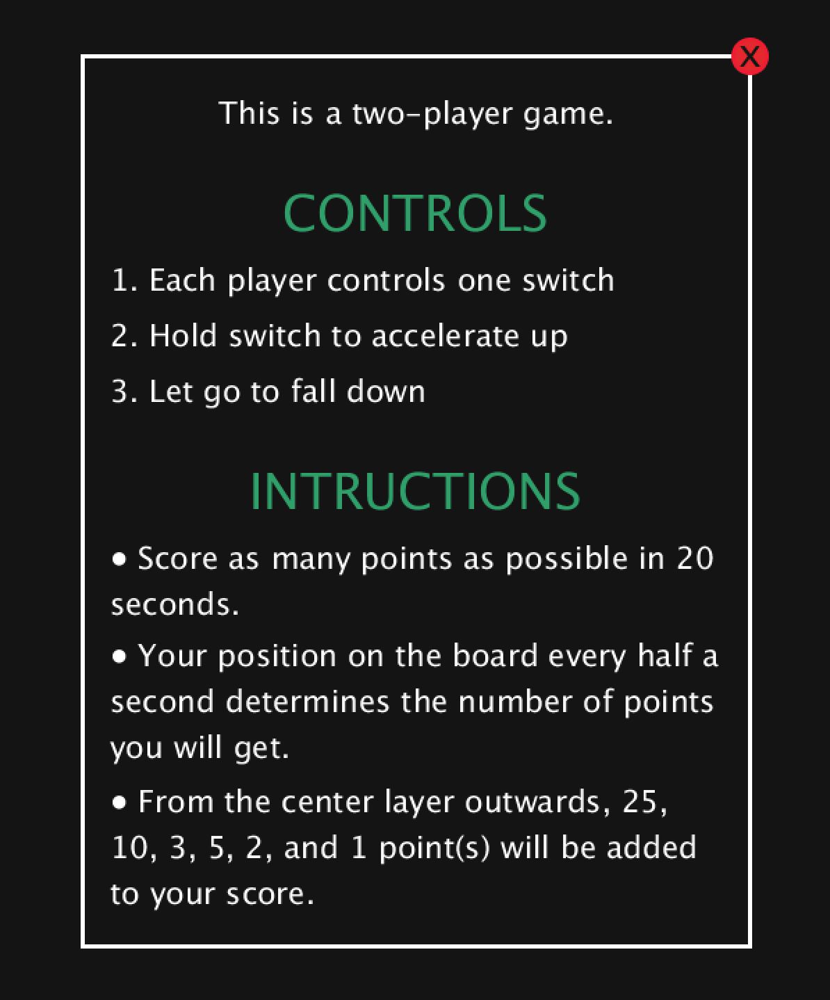
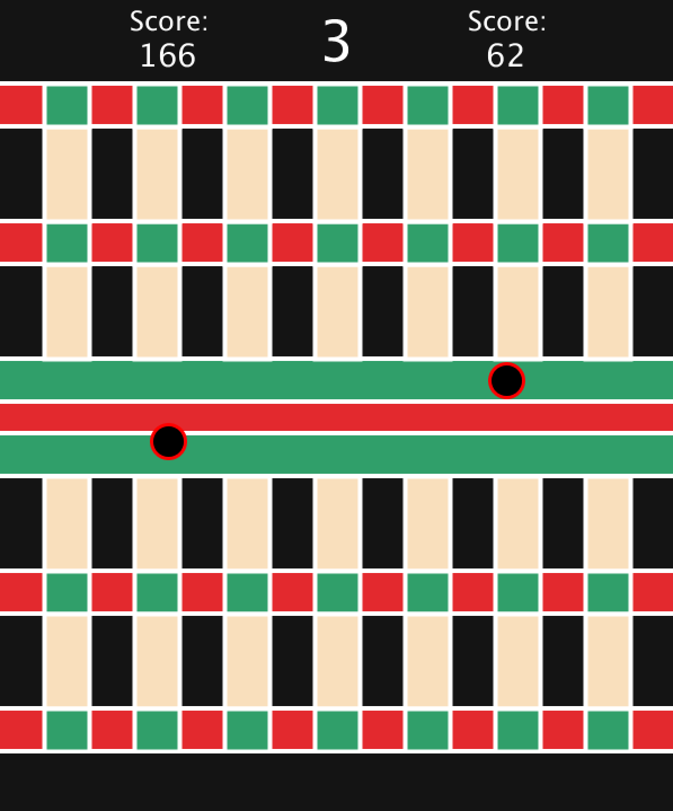
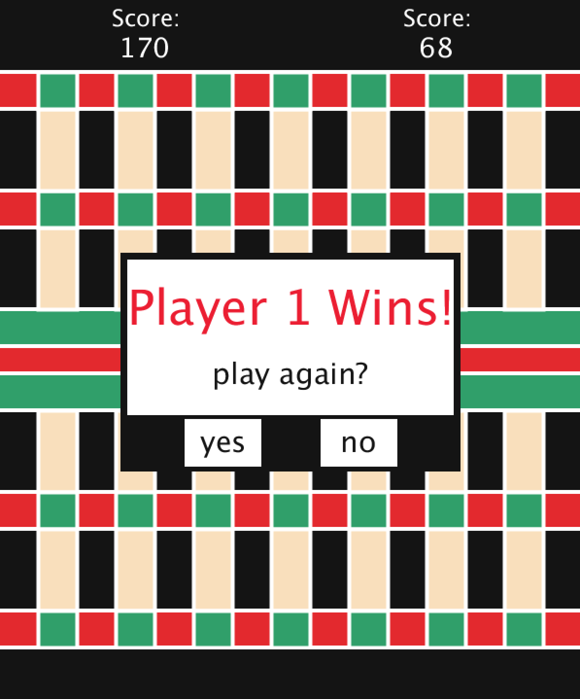
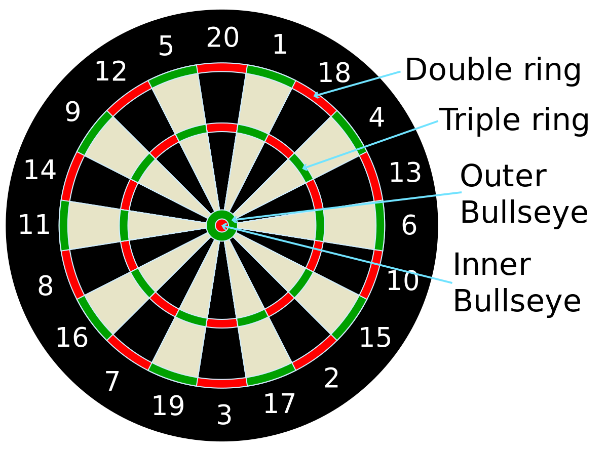
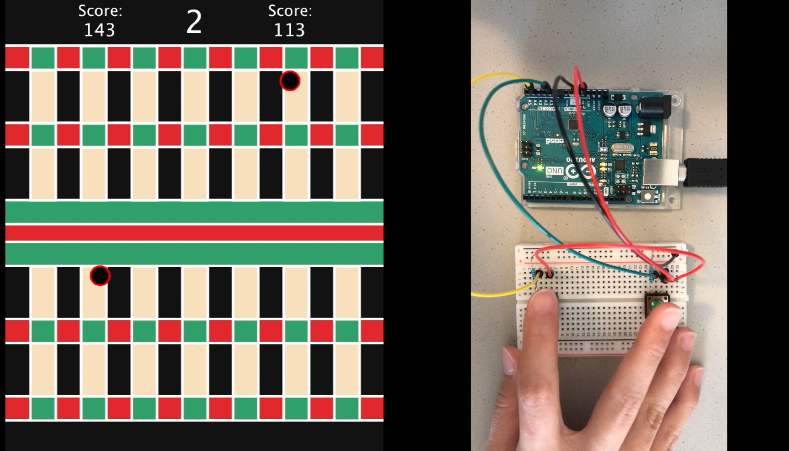
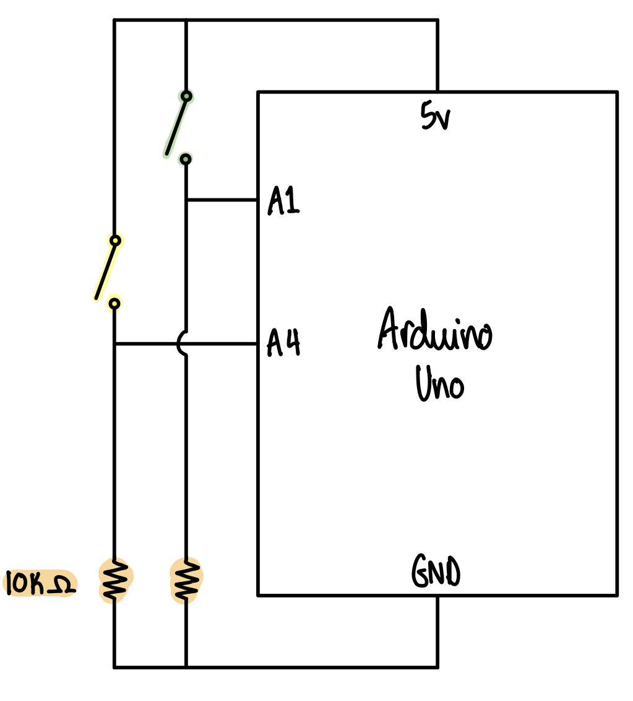
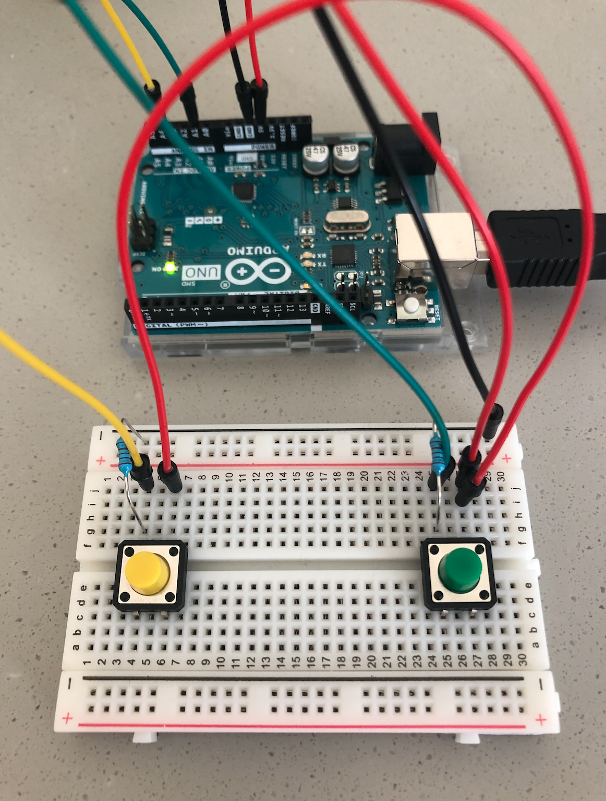

# Final Project (Adaptation of Darts)

  
  
  
  

  <b>Left to Right:</b> Main menu, Instructions screen, Game screen, Game over display.

## Description
For my final project, I decided to create an adaptation of darts for two players. I call it Darts: Deconstructed. This idea came by quite unexpectedly as I was initially trying to create a two-player car racing game. However, it didn't work out and I ended up switching my idea quite last minute. Visit [journal.md](https://github.com/ariyachlt/Intro_IM/blob/main/finalProject/journal.md) for more details.

**What is Darts?** \
I assume that most already know what 'darts' or 'dart-throwing' is. But for those who don't or may not understand how it work, darts is a competitive sport where two or more players throw darts at a target (dartboard) and win by scoring exactly 0 points from the initial 501. Depending on where on the board the player hits, that amount of point gets subtracted from the player's current score. Bullseye scores 50, the outer ring scores 25 and a dart in the double or treble ring counts double or treble the segment score (image below). There are a few other versions of the game that I won't go into. The main take-away from this will be that players score a certion amount of points depending on where on the dartboard they hit.

  

**What does my version of it look like?** \
My version of the game is a little more simplified, with some odd adaptations here and there that I actually ended up quite liking the idea of because I was trying to reuse the functionality/interaction of my previous final project idea to create a different project. Below is list of how I adapted or 'deconstructed' the game.

- Instead of a round board, I recreated a flat 'linear' board using the same idea that the center region is where the player can score the highest amount of points.
- The players try to score the most points within a certain time frame instead of trying to reach a score of zero from and intial 501. Every half a second, the program increments the players current score by the score corresponding to the position of the player's 'dart' on the board.
- The point system is slightly different and depends on how easy it is to be in each region. The harder it is to keep the 'dart' in on region, the more points that region is worth.
- To mimic how hard it can be to aim at the board, I made sure that the 'dart' is slightly difficult to control by adding acceleration.
- The darts don't necessarily get 'thrown'. Instead, the players control their 'dart' by pressing the switchings to accelerate it up or letting go to let it fall down.
- The players don't take turns to 'throw' their darts, they play the game at the same time.

In my journal, I use the word 'deconstructed' to describe my project quite often because I view it as more than an adaptation. Rather than just changing components of the game here and there, I pull pieces of the game apart (including the actual hysical appearance of the board), and reconstruct it to make it fit what funtionality I already had before changing my idea from a two-player racing game to a two-player dart game.

## Instructions
1. Each player controls one switch on the arduino
2. Hold the switch to accelerate up
3. Let go of the switch to fall down
4. Try to score as many points as possible in 20 seconds
5. Your position on the board every half a second determines the number of points you will get
6. From the center layer outwards, 25, 10, 3, 5, 2, and 1 point(s) will be added to your score

## Demo

  

Click [here]() to for a video demo.

## Schematic and Breadboarding
Below is a schematic of my circuit (left) and an image of how I breadboarded it (right). Since two players will be using switches on the same breadboard to control their 'dart', their placement is important. I made sure the switches were far apart from each other and that the wires were not in the way so that it can be comfortable for the players to control the switches.

  
  

## Challenges
The main challenge that I faced was in making the movement work for my initial final project idea which was to create a two-player car racing game. I wrote about the challenge in a lot of detail in my [journal](https://github.com/ariyachlt/Intro_IM/blob/main/finalProject/journal.md). Because I was trying to hard to make my initial idea work, I lost a lot of time that I could have spent making my project more complex. Once I finally decided to change the idea of my project completely, I faced a few challenges drawing the dartboard because it required a fair bit of calculations and taking into account the board of the rectangles. I had to re-do this part a few times to get it right and looking exactly how I wanted it to.

## Discoveries
The challenge I faced made me realise that good things can come out of things not working out the way you had hoped it would... even if it induced a lot of frustration in the process. The interaction I created ended up not working for my initial final project idea no matter how hard I tried to make it work. However, sometimes switching the project idea completely (as daunting as it can be when there is a deadline), can make the interaction work for a different idea in ways that you did not expect it to. 

## Moving Forward
If I had more time, I could have loved to make it a little more complex and similar to an actual dart game (ex. using a round board and two switches to control the x and y aiming of the dart). However, given the circumstances, I quite liked how I was able to adapt what I already had into a somewhat weird version of an existing game. The game and interaction is simple enough that it is easy to enjoy.

