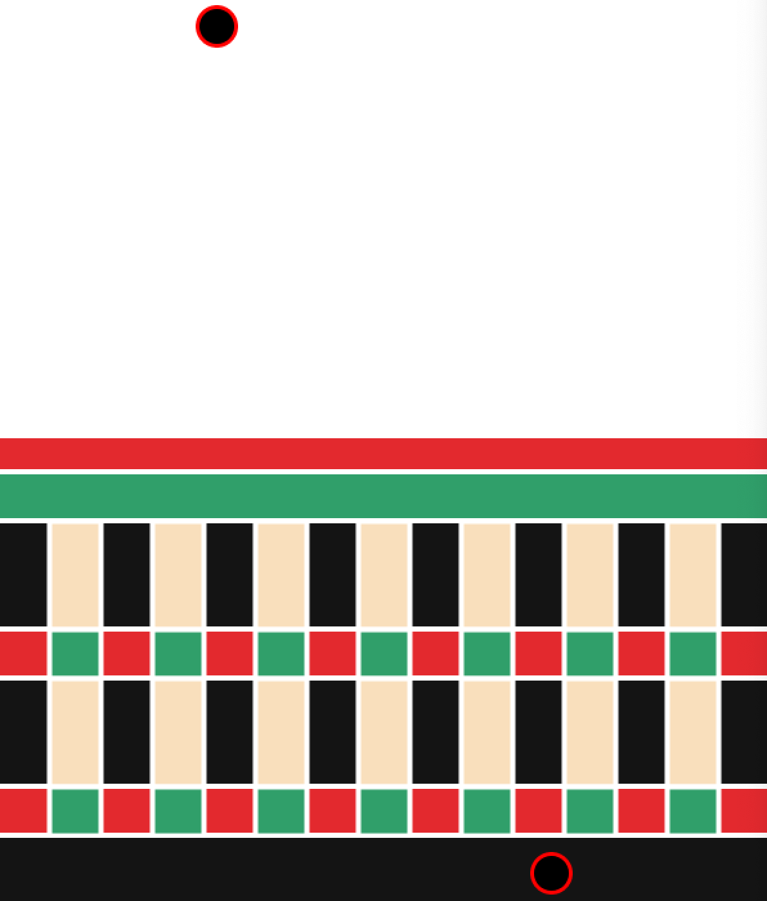

# Final Project Journal

## Preliminary Concept and Description
For my final project, I want to create a two-player game involving some form of communication between Processing and Arduino. After some brainstorming, I settled on creating a two-player car racing game. Considering the type of game I created for my midterm project, I wanted to switch gears a little and create something that takes a little less brain power to play but still remains highly interactive. The competition between two players will probably make it more engaging as well.

**Game logistics** \
The setup and goal of the game will be simple: try to get to the finish line before the other player. The cars will be side-by-side, with the finish line at the top of the screen (sketch below). I still haven't fully decided how I want to declare a winning condition but I am considering either doing a "best out of X rounds" or "first to reach X wins". This ensures that the game won't go on forever.

<p align="center">
  
</p>

**Interactions** \
The movement of the two cars will be controlled by buttons (switches). Each car will be controlled by two switches such that the car only moves forward if the two switches associated with the car are pressed alternately. This means that I will require four switches total. Information about the status of each switch will be sent to processing to tell the cars to move. Since switches will have to be pressed alternately, I will also need to store information on which switch was previously pressed for each car to ensure that the car does not move if one button is pressed twice. To ensure that the interaction is comfortable for the players, I will also need to tkae into consideration the placement ofthe switches. The tentative placement plan is shown below:

<p align="center">
  
</p>

## Progress
**Friday April 16 - Sunday April 18, 2021** \
These past few days, I actually took to pen an paper to plan my code. My main priority is to figure out the car movement conditions based on alternately pressing buttons because it is the main component of my game. I knew I had to store information on previous buttons pressed and use that information to condition the movement, however, it wasn't clear in my mind how I would actually implement it in code. Something that I find really useful when I don't have clarity on how to acually code is to just write out the steps of whats needs to happen. Attached below is an image on a snippet from my notebook scribbles.

<p align="center">
  
</p>

I first idea, I though about checking if the current switch pressed is the same as the prevous switch pressed but the amount of things that needed to be checked and reassigning new values to variables got me quite confused. I also thought about detecting releases instead of presses to ensure the cars doesn't keep moving if the player keep the switch pressed down. I then realised that if I reassign the value of the last switch pressed (as I tried to do in my first plan) it shouldn't matter if the switch is held down. However, I figured there must be an easier and more code-efficient way to check that the switches are alternating. I realised that if I check which switch was last pressed, I should be able to check the current switch pressed right away by checking if the current switch pressed is ```HIGH``` while the previous one is ```LOW```. This automatically ensures that the car only moves if one of the two switches is pressed and if they current switch pressed is not the same as the previous switch pressed. I haven't tried to implement it yet so my next step is to make sure that this idea actually works.

**Monday April 19, 2021** \
Today, I actually wrote the code in Arduino so that I can check if it actually works. Below is a snippet of the code for one of the player's switches.
```Processing
int player1LeftState, player1RightState; // Variables to store value from the switches for each player
int player1PrevSwitch = floor(random(0,2)); // Variables to store the previous states of the switch (0 = left, 1 = right)
int player1Move = 0; // Variables to tell processing whether the player should be moving (o = no, 1 = yes)

// Player 1 movement checking
   player1LeftState = digitalRead(player1LeftPIN);
   player1RightState = digitalRead(player1RightPIN);

   if (player1PrevSwitch == 0) {  // check if left switch was previously pressed
     if (player1LeftState == LOW & player1RightState == HIGH){  // check if right switch is pressed while left switch is not, move if true
       player1Move = 1;
       player1PrevSwitch = 1;
     } else {
       player1Move = 0;
     }
   } else if (player1PrevSwitch == 1) {  // check is right switch was previously pressed
     if (player1LeftState == HIGH & player1RightState == LOW){  // check if left switch is pressed while right switch is not, move if true
       player1Move = 1;
       player1PrevSwitch = 0;
     } else {
       player1Move = 0;
     }
   }
```
However, before I can check that this even works, I need to first set up the circuit on my breadboard and write some code in Processing. The breadboarding is shown below:

<p align="center">
  
</p>

Next, I began writing the communication between Arduino and Processing. I send two information from Arduino to Processing: 1) whether or not player 1 should move and 2) whether or not player 2 should move. For now, I am checking with only one player to see if I can make a rectangle (which will become the car) in processing move upwards before I add the other player's rectangle. The code does work and the car only moves upwards when the buttons are alternative. However, sometimes the car doesn't move at all even if the buttons are alternative. The fact that it is alternating seems to be detected, it just doesn't seem to always translate to movement on the screen. I suspect it may have something to do with the speed of communication between Arduino and Processing but I'm not sure. I may try to play around a little to see if I can change it but, if not, my program still works mostly fine. I'm considering adding some acceleration and deceleration so the movement looks smoother.

<p align="center">
  
</p>

**Wednesday April 21, 2021** \
Today, I decided to change my plan a little bit. Instead of pressing the buttons alternately to move the car, I decided to play around with acceleration. I changed it up so that the player has to hold the button to accelerate. I tried this with one car and it worked quite well. I removed the other switch because now there is no longer any real reason for two switches.

<p align="center">
  
</p>

**Thursday April 22, 2021** \
I realised that adding acceleration only doesn't really work because then whoever is the first the press the button will obviously get to the finish line first. Acceleration makes it too easy because then it just depends on who pressed the button first. I tried to think of ways to make it better. One idea that came to mind was to have a maximum speed that if the car reaches it, it will "crashed" or freeze, or maybe move back down a little bit. I figured it could be a nice way  to add another level of challenge and definitely makes it feel more like a game.

**Saturday April 24, 2021** \
I implemented the idea I had from yesterday. I added a maximum velocity so that if the player accelerates to the velocity, the car falls back a little bit (left). I also experimented with making the car go back to its initialy position but I'm not really satisfied with either result (middle). I played around with making the car fall down when the switch is not pressed to add another level of complexity (right). Overall, I think I can work with a combinatin of these different ideas although nothing in particular is really speaking to me.

<p align="center">
  
  
  
</p>

**Sunday April 25, 2021** \
At this point I decided that I don't like my idea from yesterday and that the two-player car racing game just isn't going to work out. However I figured I can adapt some of the functionality that I've coded into some other game. Since the 'car', which I've now changed into a ball, rises up when the switch is pressed and falls down when the switch is released, I thought I could use that to create some game where the players have to keep their ball in specific positions on the screen. The player better at controlling the ball obviously wins the game. I didn't have a fully fleshed out idea but it felt like something that I will definitely be able to work with.

**Monday April 26, 2021** \
Somehow the idea of adapting a dart board to this game came to my mind. Since I wanted the middle part of my screen to be the area where the players can earn the most points, I figured I could deconstruct the board and rearrange it linearly. Below is a sketch of what I had in mind.

<p align="center">
  
</p>

It took a little bit of planning before actually creating the board background on processing since I had to do a bit of math to figure out the placement of all the rectangles. Usually I make sure the bulk of the game functioning is done before I play around with aesthetics. But this time I started by creating the board aesthetics first because the scoring depends on the balls position on the board, which relates to how different parts of my background is arranged. Therefore, in this case, it made sense for me to make sure the background looks right before dealing with the code for how the players earn points and win. Below is the progress and final background design. 

<p align="center">
  
  
</p>

Making this bboard design reminded me of the first assignment we had where we had to make a portrait of ourselfs using shapes. I had to figure out the positions of each rectangle. I also used loops to create the alternating black and beige, and green and red layers of the board. Overall, I actually really ended up liking the design and color scheme. At this point I also realised that I don't have much time left and I need to work faster.

**Tuesday April 27, 2021** \
Today, I added the rest of the game function. I decided on a point system based on how my board was divided up. THe center most red pieces which represents the bullseye will be 25 points. The green later outside of that will be 
- added game functions
  - point system by dividing the blocks up and assigning them different points
  - deciding how to increment points --> every 1 second point added to score depends on position on the board at that exact time, changed idea to every half second because one second is too long
  - set limit of gaining points to 1 minute --> 1 minute also too long to be consistently pressing switches (too tiring), changed to 20 seconds

**Wednesday April 28, 2021** \
- worked on displaying winner, adding homescreen and instructions page
- limited time so adapted from midterm project
- added sounds


