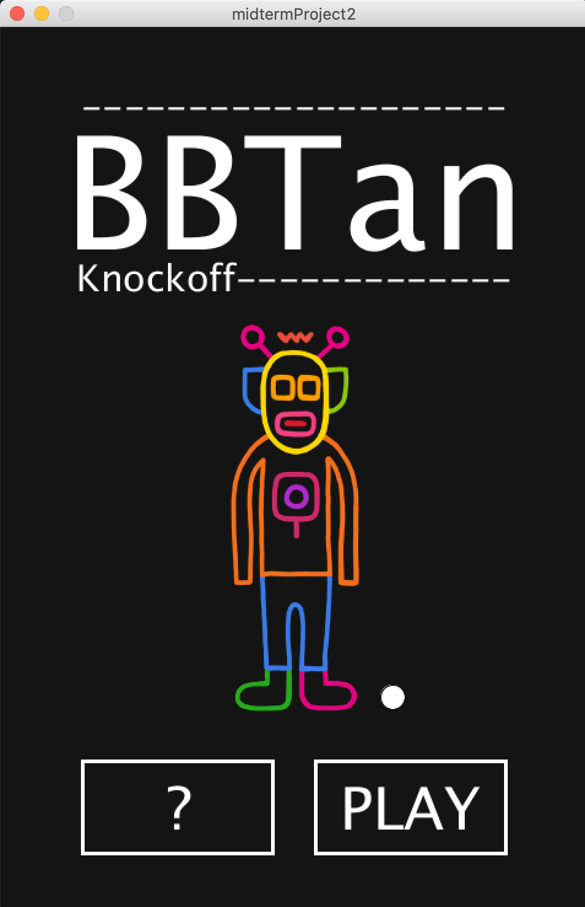
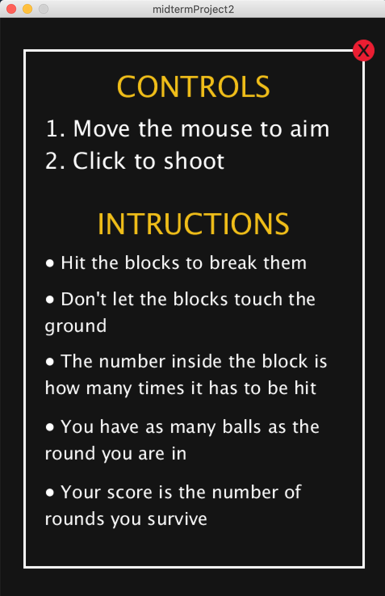
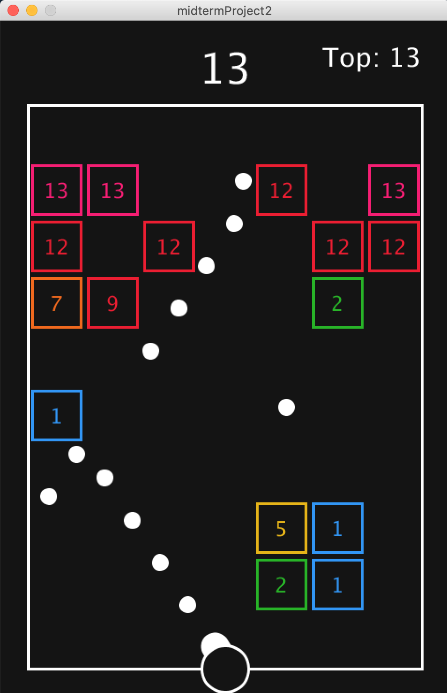
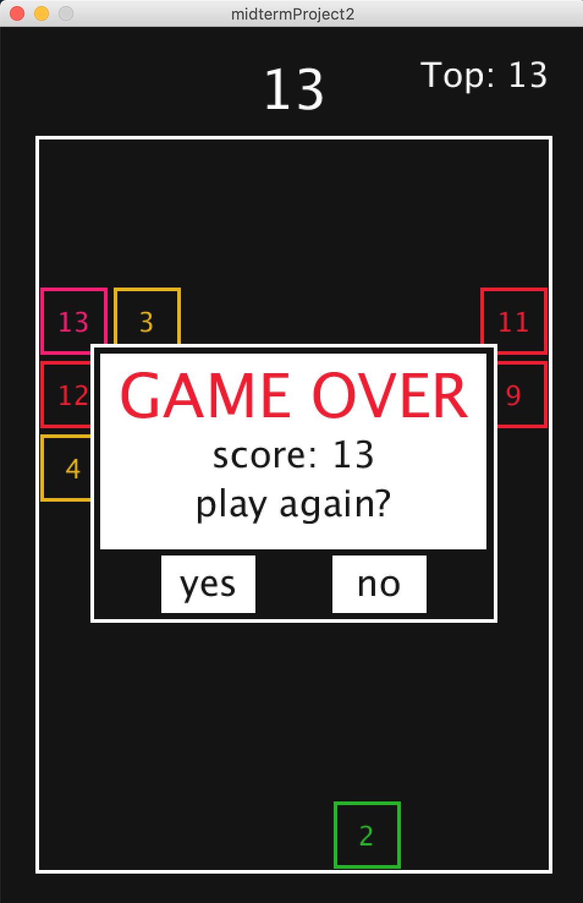

# Midterm Project (Remake of BBTan)

<p align="center">
  
  
  
  
</p>

<p align="center">
  <b>Left to Right:</b> Main menu, Instructions screen, Game screen, Game over display.
</p>

## Description
For my midterm project, I decided to re-create a game I used to play in high school on the school bus almost every single day. The game that I am trying to recreate is called BBTan (by 111%).

**What is BBTan?** \
BBTan is a ball shooting game that destroys blocks when they are hit. However, there is a twist. These ‘blocks’ come in two shapes: squares and triangles with a number inside them which indicates how many times it has to be hit to be destroyed. The player first starts by aiming the ball at some angle. Each time a block is hit, the number is reduced by one, and the block is considered destroyed when the number reaches zero. After each round of shooting, the surviving blocks move down one grid row, and a new row of blocks is created. The number inside each new row of blocks depends on the round, and the player score is the number of rounds the player survives before the bottom-most blocks reach the bottom of the screen. The original game also has a bunch of power-ups that the player can hit with current balls to increase the number of balls thrown in each round, scatter the balls in random directions, or slash entire rows or columns.

**What does my version of it look like?** \
My version of the game is a little more simplified, with most of the key elements intact. My experience playing this game allowed me to make an informed decision of what to keep and what to modify so that the game retains the key components and remains playable.  \
\
Things that stayed the same:
- The number of balls inside the block is the number of hits required to break it
- The first row of blocks begins in the 'second' row
- The blocks move down one row after each round
- The number of rounds determines the score
- The game is over when the block touches the ground
- The color scheme/aesthetics (white balls, colorful blocks on a dark background)
- The positioning of the round/current score and highscore ('Top')

Things I modified:
- Removed the triangular blocks
- Removed power ups (ex. increase balls, strike entire rows/columns)
- Defined the number of balls as the current round instead
- Balls only shoot from the center of the ground instead of where the first ball in each round falls

Most modifications are due to extra challenges in defining conditions or calculations. They add too many layers of complexity on top of a program that is already quite time consuming to recreate.

## Instructions
1. Move the mouse to aim
2. Click to shoot
3. Don't let the blocks touch the ground
4. Beat your own/others' highscore!

## Demo
<p align="center">
  
</p>

Click [here](https://youtu.be/lcrsGA2HkJk) to watch it with sound.

## Process
1. Created a 420 by 600 "box" inside the 480 by 720 canvas where the game will be contained in. This box region was then be split into 10 rows and 7 columns where 60 by 60 blocks will fit.
2. Defined a ball class which will take one argument (modified from previously two: angle and initial x position), the angle, and wrote functions to move the ball by the given angle, and reflect off walls (the 'box').
3. Wrote a grid class which creates a 2D array with 10 rows and 7 columns and a function within the class to display the block if the number inside it is not 0 (a block exists and needs to be hit).
4. Created a class to defined the interactions within the game called ```interactionSystem``` and write a function to check for collisions between the balls and the blocks.
5. Wrote functions to calculate the initial angle of the ball using the ```mouseX``` and ```mouseY``` positions, add as many ball objects into an ArrayList as the round number, and shoot one ball at a time using the modulo of ```frameCount```.
6. Adjusted the wall collision function to remove the ball when it hits the ground instead of reflect.
7. Wrote functions to add blocks to the second row of the game and move blocks down one row after each round.
8. Created a shooter so players can visualize the shooting angle.
9. Defined a game over condition by checking if any columns in the bottom row is not zero.
10. Created a main menu and instructions page, and added ```mouseClicked()``` events to the make the buttons "clickable".
11. Added sounds and wrote a function to change the cursor to a hand when hovering over a clickable area.
12. Played around with aesthetics!
13. Added a component to store and keep track of highscore.

The process is describe in full detail [here](https://github.com/ariyachlt/Intro_IM/blob/main/midtermProject/journal.md).

## Challenges
I faced so many more challenges that I expected to during this process. Most of them led me to either simplify or completely remove certain components (as described above). Below is a summary of my challenges that can also be read in full detail in the [journal](https://github.com/ariyachlt/Intro_IM/blob/main/midtermProject/journal.md):

- Keeping track of transformations and colors (many times I just ended up defaulting to ```push()``` and ```pop()```)
- Remembering basic trigonometry :expressionless: (could have saved me quite a bit of time)
- Consistently getting ```ArrayIndexOutOfBoundsException``` and ```NullPointerException``` errors when trying things out, causing the program to crash (maybe I just need to think a little more before I run chunks of code?)
- Defining the collision condition between the blocks and the balls (solution is describe in the [journal](https://github.com/ariyachlt/Intro_IM/blob/main/midtermProject/journal.md))
- Some balls still go through gaps between blocks and I couldn't figure out a way to fix it. However, it happens only every once in a while at very specific angles and isn't a major obstacle in the functionality of the game. After spinning my head trying to figure it out, I gave up and ended up just created visible gaps between the blocks to make it look a little less weird.
- How to loop the 2D array to "move" the blocks down one row after each round (defining the correct init, test and update in the ```for``` loop)
- Finding sounds I actually like/fit the game
- Reading the text file containing the highscore and converting it from a string to integer to it can be used (I had to try many different functions)
- The color of the blocks was challenging to set because I don't think I wrote my class and the program in a way that allows me to easily set the block colors. Instead of creating a nice gradient, I ended up just defining the color of each block as one of the 6 preset colors based on the number in the block relative to the round.

## Discoveries
I discovered that this took way more time than I expected but I was too far in when I realised so I just had to keep going. This project made me realise how important it is to stay organized and consistent as it was very easy for me to get lost in my functions and transformations. Much of what I wrote can probably be compressed and made more efficient but at some point I was just to deep into the process to change up everything. Thank you ```push()``` and ```pop()``` for coming to my rescue. Furthermore, I realised that creating a lot of boolean variables to use as a "checkpoints" at various locations made it easy for me to define when to call and perform certain functions and actions. During this process, I also came across a few new functions:
- ```textAlign()```: can take up to two arguments to align the text vertically and horizontally (so much easier than CSS)
- ```createReader()``` and ```createWrite()```: Creates a ```BufferedReader``` object that can be used to read files line-by-line and creates a new file in the sketch folder, allowing me to write to it
- ```.println()```, ```.flush()``` and ```.close()```: Allows you to write to the file, and make the file correctly.

## Moving Forward
If I had more time I would try to figure out why the balls are going through these invisible 'gaps' and re-write the grid class so that it has a color attribute. It would also be interesting to add some animations when the blocks break (ex. tiny colorful squares breaking off) like in the actual game. It looks like something that can be done using particle systems. Overall, I am quite happy with the final result.


