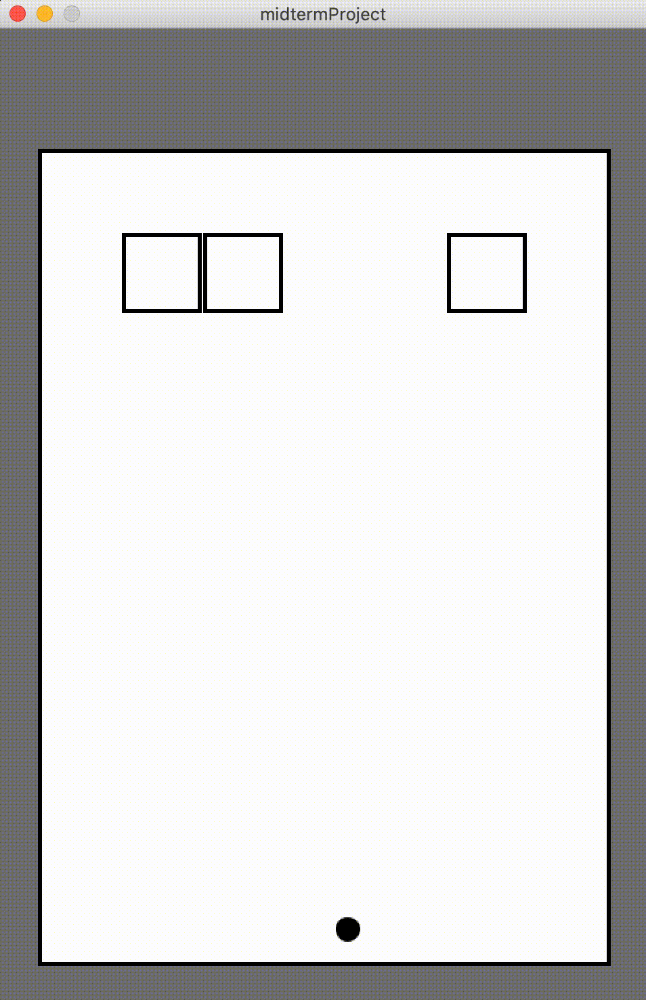
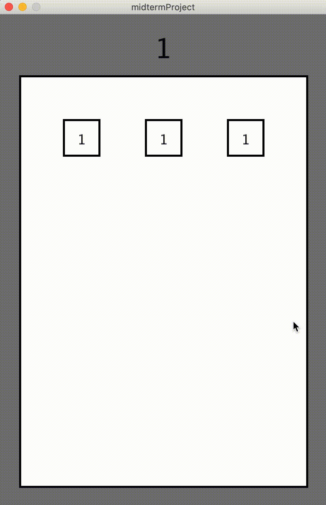

# Midterm Project Journal

<p align="center">
  
  
  
</p>

<p align="center">
<i> BBTan demo </i>
</p>

## Description
For my midterm project, I decided to re-create a game I used to play in high school on the school bus almost every single day. The game that I am trying to recreate is called BBTan (by 111%). 

**What is BBTan?** \
BBTan is a ball shooting game that destroys blocks when they are hit. However, there is a twist. These ‘blocks’ come in two shapes: squares and triangles with a number inside them which indicates how many times it has to be hit to be destroyed. The player first starts by aiming the ball at some angle. Each time a block is hit, the number is reduced by one, and the block is considered destroyed when the number reaches zero. After each round of shooting, the surviving blocks move down one grid row, and a new row of blocks is created. The number inside each new row of blocks depends on the round, and the player score is the number of rounds the player survives before the bottom-most blocks reach the bottom of the screen. The original game also has a bunch of power-ups that the player can hit with current balls to increase the number of balls thrown in each round, scatter the balls in random directions, or slash entire rows or columns.

**What will my version of it look like?** \
For my version of the game, I hope to re-create a more simplified version of the game while keeping most of the key elements. From the many years that I have been playing the game, I can already tell that there are quite complex elements that I would not be able to include within the time frame of the midterm project. Modifications that I will be making are mostly in relation to the power-ups. I decided to not include any power-ups at all. Therefore, there will be no power-ups scattered throughout the game board that will allow the player to increase the number of balls thrown in each round, reflect the balls in random directions, or slash entire rows or columns. However, from experience, having multiple balls as the levels get more difficult because the blocks get harder to break (higher numbers) is a key component that I should not leave out. Therefore, I decided to keep that aspect by making it round-dependent. In my version, the round number will determine how many balls are being thrown. If I have more time once the backbone of the game is completed, I may attempt to include the other power-ups. But for now, those additional elements are beyond the scope of my midterm project.

## Progress
**Thursday Feb 18, 2021** \
Today, I mostly spent my time doing some research on how to detect diagonal collisions for my triangular blocks. I found out how I can check for diagonal collisions on a line ([here](http://www.jeffreythompson.org/collision-detection/line-circle.php)). This is something that I imagine can be applied to my triangles. However, it looks like an extra layer of complexity on top of the already quite complex game that I am trying to re-create so I decided to not include triangle blocks. Not only would I have to create triangles with 4 different combinations of adjacent legs, but I would also have to figure out a way to detect collisions on all sides of the 4 different possible triangles and take into account which direction the ball is coming from.

**Friday Feb 19, 2020** \
I began the coding component by creating a 480 by 720 canvas and creating 30-pixel borders on each side (except the top, which is 90 pixels) using rectangle. The ‘box’ where the game is contained is, therefore, 420 by 600 in size. This will make it easy for me to divide the width and height by 60 and create a 7 by 10 grid for the 60 by 60 squared blocks. I then create a ball class with the position, radius, speed, and angle attributes and made the constructor take two arguments: the starting x position and the angle of the ball. This is because at each round the ball will always start at the bottom of the screen, and shoots at an angle specified by the player. The x position of the ball will start at the center of the screen (as opposed to the left side in the original game), and for each round after the first, the starting x position will be determined by where the first ball falls. I wrote a function to move the ball by adding the speed in the x and y directions to the position of the ball. How much the ball moves in each direction depends on the angle. I tested the ball movement by creating an instance of it in setup() and displaying it in draw(). The ball movement seems to work fine except I forgot that if I wanted to work in degrees I need to call the radians() function to convert my initial degrees to radians so the balls were initially flying in very weird directions.
<p align="center">
  
</p>

**Saturday Feb 20, 2021** \
Now that I know my ball is moving at the correct angles, the next step is to check collisions with the walls. This part is quite easy, as I only need to check if the positions of the ball are touching the x and y positions of the border. If it is, then reflect by multiplying the respective x or y speed by -1. For now, the ball is reflecting off of all 4 sides. Later on, I will modify it so that if the ball passes the bottom border then it will be removed from the list of balls. This already tells me that at some point I will probably need to create an array list to store my balls and dynamically add and remove them. After getting the basic physics of the ball working, I moved on to creating a class for the grid of where the blocks will exist. I first started by creating a 2D array with 10 rows and 7 columns which will be used to store information about whether or not there is a block in that position (boolean array). I wrote a simple display function that checks each row and column and draws a square if there exists a block in the grid position. I tested the class by creating a few different instances of the block and noticed that I got the x and y positions of the rectangle that I was drawing flipped. I forgot to think about how the x position and the y position of the rectangle are determined by the column and row it is in, respectively. It made me realize that is very easy to get lost in the maths in this project.
<p align="center">
  
  
</p>

**Sunday Feb 21, 2021** \
I did not end up making any modifications to the code today. However, I did realize that I can actually simplify the class containing the grid of blocks. Since the block should only appear when it has to be hit by a ball (when the number associated with the block is at least 1), I can modify the 2D array to actually store the number of times the block has to be hit instead of whether or not to display the block. This way, I can check if the number in the 2D array is greater than zero and display the block if it is.

**Monday Feb 22, 2021** \
I applied the modifications I thought about yesterday to the display() function in the class that deals with the grid of blocks and it worked as expected! The next step was to figure out how to check for collisions between the ball and each block. I figured I could write a class to define the interaction between the two but I was unsure how to code for the actual detection. I first tried to loop through each ball and each position in the grid array and check if the ball collides with the block. The main challenge came when I had to find a way to figure out how to detect which side of the block the ball collided with as that determines the axis to flip the direction of the ball. I tried to check the top, bottom, left, and right positions of the block but it was just so much additional code that I was not able to make work. A friend suggested that I could try using the current grid position and the upcoming grid position to account for the direction that the ball is coming. It was not a bad idea as this means that I can try to check for the current and next grid row and column the position of the ball is in and based on that information, I can reflect the ball when it collides with the block. As I was trying to implement the code, I realized it is no longer necessary to loop through the block array anymore. I can instead just loop through each ball and check if the next x and y position of the ball is non-zero (has a block). If it is, then I can check if the next and current grid row and column the ball is in is different or now. If the next and current rows are different, then the y-direction is reflected, and if the next and current columns are different, then the x-direction is reflected. This part to me very long to implement because there were so many aspects to think about. This working block collision code still needs to take into account the radius of the ball. This is something I will probably play around with later if I have time as it is something that is not neccessary for the game to work.
<p align="center">
  
</p>

**Tuesday Feb 23, 2021** \
Today, I did not make any major progress with the program. I mostly spent the time adding visual demos to the journal. I thought about adding chunks of code too but felt like it could be too much and too confusing as so many edits are made consistently. I figured it would be better to just comment the code well as I am already describing the process in quite a bit of detail. In terms of programming, I added text to the blocks so that the player can see how many more times the block has to be hit to break it. I mostly struggled with the positioning because I wanted to make sure the eveything was centered and that it also dynamically centers single and double (or triple) digit numbers. I found out that there is a textAlign() function in processing that can center the text vertically and horizontally. Below is the result:
<p align="center">
  
</p>

**Wednesday Feb 24, 2021** \
For today, I decided to plan out the next steps I have to take. There are quite a few things that I still need to do before moving onto aesthetics:
1. Shoot the ball(s) and an angle given by the mouseX and mouseY position
2. Remove balls from the array when they fall to bottom of the rectangle (border)
3. Move the blocks down 1 row after each round and add new blocks to the second row
4. Write a method to detect when the block touches the bottom of the screen (game over)
5. Keep track of the score (number of rounds)
6. Build array of balls based on the round
7. Write the screen with instructions and game over page that allows the player to restart if they want (there is no winning, it is a highscore system) 

**Thursday Feb 25, 2021** \
Today I worked on the method to shoot the balls at an angle determined by the mouseX and mouseY position when the player clicks on the screen. I used a simple arctan(opposite/adjacent) calculation to get the angle from the mouse positions. Calculating the "opposite" and "adjacent" lengths was quite challenging because I had to take into account the position that the ball is being shot from (240, 690). I then used the atan() function to get the arctan of my ratio in radians and set the angle of the ball accordingly. However, I could not get the angle to work properly. I triple-checked my calculations but it seems that when the angle is less than 45 degrees the ball just bounces from left to right at the bottom of the screen. Even when the angle is greater than 45 degrees, it stills seems to be off by a few degrees from where my mouse was clicked. I will dedicate tomorrow to figuring out why this is happening.
<p align="center">
  
  
</p>

**Friday Feb 26, 2021** \
In my attempt to debug the angle issue today, I printed out all the values at every step of the calculation. This includes:
- the mouseX and mouse Y position
- the opposite and adjacent lengths (taking into account all the tranformations)
- the ratio opposite/adjacent
- and finally, the atan() results

A sample block of code from the program is shown below (for calculating angles when the mouse is clicked on the right side of the screen):
```
// check mouse position is inside the border
if(mouseX > offset && mouseX < width - offset && mouseY > offsetTop && mouseY < height - offset){
  // check is mouse position is on the right half of the screen
  if(mouseX > width/2){
    mouseAngle = -atan(( height - offset - mouseY )/( mouseX - width/2 ));  // angle calculation
    println(mouseX, mouseY);
    println(mouseX - width/2, height - offset - mouseY);
    println(( height - offset - mouseY )/( mouseX - width/2 ));
    println(mouseAngle);  
  }
}
```
The first two lines printed appear fine and proved that my calculation for the opposite and adjacent lengths were done corrently. However, it seems that the error appears when I try to divide the opposite length by the adjacent length. This calculation only returns a 0 or 1, which explains why my balls will only shoot at 0 or 45 degrees. My guess is that it has something to do with the variable type of mouseX and mouseY. I tried to type-cast it to a float using "(float)" but it did not work. I then played around with splitting the calculation into smaller parts (example below). 
```
// check mouse position is inside the border
if(mouseX > offset && mouseX < width - offset && mouseY > offsetTop && mouseY < height - offset){
  // check is mouse position is on the right half of the screen
  if(mouseX > width/2){
    float opp = height-offset-mouseY;  // opposite length
    float adj = mouseX - width/2;  // adjacent length
    mouseAngle = -atan(opp/adj);  // angle calculation 
  }
}
```
For some reason I cannot explain, storing the opposite and adjacent lengths into float variables and then inputting them into the atan() functions solved the issue!
<p align="center">
  
</p>

**Saturday Feb 27, 2021** \
Today I began by working on making the balls shoot out one following the other when there is more than one ball. I struggled a little bit to call the function to shoot balls in the correct place. In my first attempt, I called the function in mouseClicked(). This did not work because I was using the modulo of frameCount to try an shoot the balls one after the other. I realised that in mouseClicked(), it only checks if the exact frameCount when I clicked is divisible by 6. I realised that it is something that I should probably call in draw. Therefore, I wrote two different boolean variables to check if the balls are shooting and if balls can be shot, and used that to call the shootBall() function. The first boolean (canShoot) is true when, within that round, the ball hasn't been shot yet. This is to prevent the player from being able to shoot again. The second boolean (shooting) is true when the mouse is clicked and the balls should be shooting. This is to actually shoot the balls. Once I figured out the shooting, I adjusted the checkWallCollision() function to remove the ball from the ArrayList when it hits the bottom of the border instead of reflecting it. Figuring out how to check each ball object and remove it was quite challenging because for some reason iterating through each ball in the ArrayLise using "for(Ball b: Balls)" didn't work but "for(int i = 0; i < Balls.size(); i++)" did.
<p align="center">
  
  
</p>

I then moved on to setting the number of balls in the ArrayList to the round it is in. The round number is displayed at the top. I was initially going to make it so that the ball in the next round is shot from the X position where the first ball in the current round fell. However, I decided to keep everything in the center as I would have to re-do the angle calculations and did not want to end up spending too much time on such a minor detail.
<p align="center">
  
</p>


<p align="center">
  
  
</p>

<p align="center">
  
  
</p>
